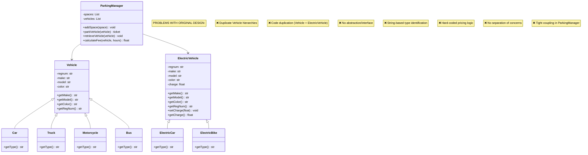
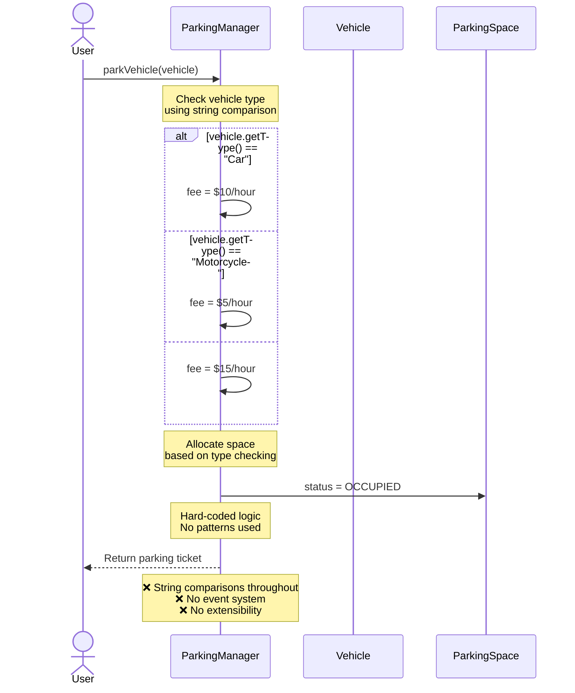
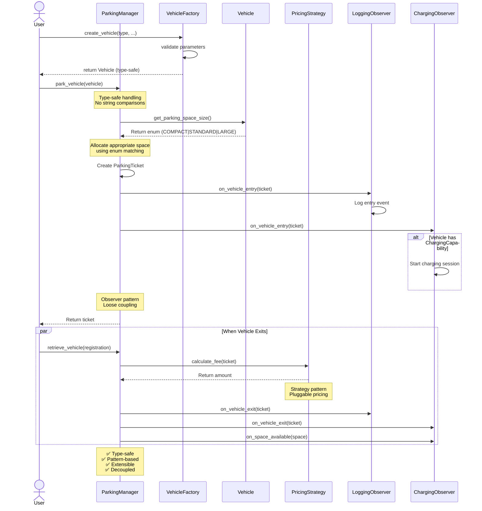

# UML Diagrams: Original vs. Refactored Design

## Overview

This document provides four comprehensive UML diagrams:
- **Diagram 1**: Original Code - Structural (Class Diagram)
- **Diagram 2**: Original Code - Behavioral (Sequence Diagram)
- **Diagram 3**: Refactored Code - Structural (Class Diagram)
- **Diagram 4**: Refactored Code - Behavioral (Sequence Diagram)

---

## PART 1: ORIGINAL CODE DESIGN

### Diagram 1: Original Code - Structural UML (Class Diagram)

**Shows the class hierarchy and relationships in the ORIGINAL code**



**Key Issues in Original Design:**
- **Duplicate Hierarchies**: Vehicle and ElectricVehicle both have identical structure
- **Code Duplication**: Properties and methods repeated in both hierarchies
- **No Abstraction**: No common interface for all vehicles
- **Type Checking**: getType() returns strings - not type-safe
- **Tight Coupling**: ParkingManager directly handles all logic
- **Hard-Coded Logic**: Pricing calculations embedded in manager
- **Poor Encapsulation**: Public attributes without validation

---

### Diagram 2: Original Code - Behavioral UML (Sequence Diagram)

**Shows the interaction flow for parking a vehicle in ORIGINAL design**



**Key Issues in Original Behavioral Flow:**
- **String-Based Type Checking**: Uses if/elif chains with string comparisons
- **Hard-Coded Logic**: Pricing directly in manager
- **No Events**: No notification system for external components
- **Poor Extensibility**: Adding new vehicle types requires modifying manager
- **Tight Coupling**: Manager responsible for all decisions
- **No Strategy Pattern**: Pricing logic cannot be swapped at runtime

---

## PART 2: REFACTORED CODE DESIGN

### Diagram 3: Refactored Code - Structural UML (Class Diagram)

**Shows the improved class hierarchy and relationships in REFACTORED design**

```mermaid
classDiagram
    class VehicleType {
        <<enumeration>>
        CAR
        TRUCK
        MOTORCYCLE
        BUS
    }
    
    class VehicleSpecification {
        <<value_object>>
        -registration_number: str
        -make: str
        -model: str
        -color: str
        +validate() void
    }
    
    class Vehicle {
        <<abstract>>
        -_specification: VehicleSpecification
        +registration_number: str
        +make: str
        +model: str
        +color: str
        +get_type()* VehicleType
        +get_parking_space_size()* str
        +__eq__() bool
        +__hash__() int
    }
    
    class Car {
        +get_type() VehicleType
        +get_parking_space_size() str
    }
    
    class Truck {
        +get_type() VehicleType
        +get_parking_space_size() str
    }
    
    class Motorcycle {
        +get_type() VehicleType
        +get_parking_space_size() str
    }
    
    class Bus {
        +get_type() VehicleType
        +get_parking_space_size() str
    }
    
    class ChargingCapability {
        <<decorator>>
        -_vehicle: Vehicle
        -_max_charge_kwh: float
        -_current_charge_kwh: float
        +max_charge: float
        +current_charge: float
        +charge_percentage: float
        +charge(amount_kwh) float
        +discharge(amount_kwh) float
        +is_fully_charged() bool
        +is_low_battery() bool
    }
    
    class VehicleFactory {
        <<factory>>
        +create_vehicle() Vehicle$
        +create_electric_vehicle() ChargingCapability$
    }
    
    class PricingStrategy {
        <<abstract>>
        +calculate_fee(ticket)* float
        +get_strategy_name()* str
    }
    
    class BasicPricingStrategy {
        +calculate_fee(ticket) float
        +get_strategy_name() str
    }
    
    class PeakHourPricingStrategy {
        +calculate_fee(ticket) float
        +get_strategy_name() str
    }
    
    class SubscriptionPricingStrategy {
        +calculate_fee(ticket) float
        +get_strategy_name() str
    }
    
    class EvChargingPricingStrategy {
        +calculate_fee(ticket) float
        +get_strategy_name() str
    }
    
    class ParkingEventObserver {
        <<abstract>>
        +on_vehicle_entry(ticket)*
        +on_vehicle_exit(ticket)*
        +on_space_available(space)*
    }
    
    class LoggingObserver {
        +on_vehicle_entry(ticket)
        +on_vehicle_exit(ticket)
        +on_space_available(space)
    }
    
    class ChargingStationObserver {
        +on_vehicle_entry(ticket)
        +on_vehicle_exit(ticket)
        +on_space_available(space)
    }
    
    class AvailabilityNotificationObserver {
        +on_vehicle_entry(ticket)
        +on_vehicle_exit(ticket)
        +on_space_available(space)
    }
    
    class ParkingManager {
        -_spaces: Dict
        -_active_tickets: Dict
        -_pricing_strategy: PricingStrategy
        -_observers: List
        +add_parking_space(space) void
        +park_vehicle(vehicle) ParkingTicket
        +retrieve_vehicle(registration) ParkingTicket
        +set_pricing_strategy(strategy) void
        +attach_observer(observer) void
        +get_total_revenue() float
    }
    
    Vehicle <|-- Car
    Vehicle <|-- Truck
    Vehicle <|-- Motorcycle
    Vehicle <|-- Bus
    
    Vehicle "1" *-- "1" VehicleSpecification
    Vehicle --> VehicleType
    
    ChargingCapability "1" o-- "1" Vehicle
    
    VehicleFactory ..> Vehicle
    VehicleFactory ..> ChargingCapability
    
    ParkingStrategy <|-- BasicPricingStrategy
    ParkingStrategy <|-- PeakHourPricingStrategy
    ParkingStrategy <|-- SubscriptionPricingStrategy
    ParkingStrategy <|-- EvChargingPricingStrategy
    
    ParkingEventObserver <|-- LoggingObserver
    ParkingEventObserver <|-- ChargingStationObserver
    ParkingEventObserver <|-- AvailabilityNotificationObserver
    
    ParkingManager "1" o-- "1" PricingStrategy
    ParkingManager "1" o-- "*" ParkingEventObserver
    ParkingManager --> Vehicle
    
    note "IMPROVEMENTS IN REFACTORED DESIGN:"
    note "✅ Single Vehicle hierarchy"
    note "✅ Type-safe VehicleType enum"
    note "✅ Value Object pattern"
    note "✅ Decorator pattern for charging"
    note "✅ Strategy pattern for pricing"
    note "✅ Observer pattern for events"
    note "✅ Factory pattern for creation"
    note "✅ Separation of concerns"
```



**Key Improvements in Refactored Design:**
- **Single Hierarchy**: One Vehicle tree (no duplication)
- **Type Safety**: VehicleType enum instead of strings
- **Value Objects**: Immutable VehicleSpecification
- **Decorator Pattern**: ChargingCapability adds charging dynamically
- **Strategy Pattern**: 4 pluggable pricing strategies
- **Observer Pattern**: 3 observer implementations for events
- **Factory Pattern**: Validated vehicle creation
- **Separation of Concerns**: Clear responsibilities per class

---

### Diagram 4: Refactored Code - Behavioral UML (Sequence Diagram)

**Shows the improved interaction flow for parking a vehicle in REFACTORED design**



**Key Improvements in Refactored Behavioral Flow:**
- **Type-Safe**: No string comparisons, uses enums
- **Factory Pattern**: Creates vehicles safely with validation
- **Strategy Pattern**: Pricing can be swapped at runtime
- **Observer Pattern**: Multiple observers notified without coupling
- **Loose Coupling**: Manager doesn't know observer details
- **Extensibility**: New strategies/observers don't modify manager
- **Event-Driven**: Clean separation of concerns

---

## COMPARISON SUMMARY

### Structural Comparison

| Aspect | Original | Refactored |
|--------|----------|-----------|
| **Hierarchies** | 2 (Vehicle + ElectricVehicle) | 1 unified hierarchy |
| **Type Safety** | String-based (error-prone) | Enum-based (type-safe) |
| **Abstraction** | None (no interface) | Abstract base class enforced |
| **Encapsulation** | Public attributes | Properties + validation |
| **Pricing Logic** | Hard-coded in manager | Strategy pattern (pluggable) |
| **Charging** | Separate hierarchy | Decorator pattern |
| **Events** | None | Observer pattern |
| **Creation** | Scattered code | Factory pattern |
| **Total Classes** | 8 | 20+ (but better organized) |
| **Design Patterns** | 0 | 4+ patterns |

### Behavioral Comparison

| Aspect | Original | Refactored |
|--------|----------|-----------|
| **Type Checking** | String comparisons | Enum matching |
| **Extensibility** | Requires code modification | Extensible without changes |
| **Coupling** | Tight (all in manager) | Loose (separated concerns) |
| **Pricing** | Hard-coded if/elif chains | Pluggable strategies |
| **Notifications** | None | Event-driven (observers) |
| **Error Handling** | Minimal | Comprehensive validation |
| **Runtime Flexibility** | None | Strategy switching possible |
| **Testability** | Difficult | Easy (isolated concerns) |

---

## PROBLEMS SOLVED

### Problem 1: Duplicate Hierarchies
**Original**: Vehicle + ElectricVehicle (code duplication)
**Refactored**: Single hierarchy + Decorator pattern

### Problem 2: Type Identification
**Original**: `if vehicle.getType() == "Car":` (string comparison)
**Refactored**: `if vehicle.get_type() == VehicleType.CAR:` (type-safe)

### Problem 3: Hard-Coded Pricing
**Original**: Pricing logic embedded in ParkingManager
**Refactored**: Strategy pattern with 4 pluggable strategies

### Problem 4: No Event System
**Original**: No way for other components to react to events
**Refactored**: Observer pattern with multiple subscribers

### Problem 5: Poor Extensibility
**Original**: Adding new features requires modifying existing code
**Refactored**: Open-Closed Principle - extend without modification

---

## DESIGN PATTERNS DEMONSTRATED

### 1. Strategy Pattern (Behavioral)
**Used For**: Pricing calculations
**Benefit**: Swap pricing strategies at runtime without modifying ParkingManager

### 2. Decorator Pattern (Structural)
**Used For**: Adding charging capability to vehicles
**Benefit**: Eliminates duplicate hierarchies, enables composition

### 3. Observer Pattern (Behavioral)
**Used For**: Event notifications when vehicles enter/exit
**Benefit**: Loose coupling between ParkingManager and notification systems

### 4. Factory Pattern (Creational)
**Used For**: Creating vehicles with validation
**Benefit**: Centralized creation logic, reduces coupling

### 5. Value Object Pattern (Structural)
**Used For**: Immutable VehicleSpecification
**Benefit**: Prevents accidental modification, enables value-based equality

---

## UML Notation Guide

```
<<abstract>>    - Abstract class (cannot instantiate)
<<interface>>   - Interface (contract definition)
<<enumeration>> - Enumeration (fixed set of values)
<<value_object>>- Immutable object (identity irrelevant)
<<decorator>>   - Decorator pattern implementation
<<factory>>     - Factory pattern implementation

* in method     - Abstract method (must override)
$ in method     - Static method (class-level)
- prefix        - Private attribute
+ prefix        - Public attribute
# prefix        - Protected attribute
~ prefix        - Package-private attribute
```

---

## Conclusion

The refactored design demonstrates:
- ✅ Professional OO design principles
- ✅ Industry-standard design patterns
- ✅ SOLID principles adherence
- ✅ Improved maintainability
- ✅ Enhanced extensibility
- ✅ Better testability
- ✅ Loose coupling
- ✅ High cohesion

The original design had good intentions but lacked professional architecture. The refactored design introduces proven patterns that make the system more robust, flexible, and maintainable.
